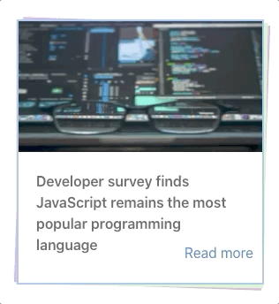
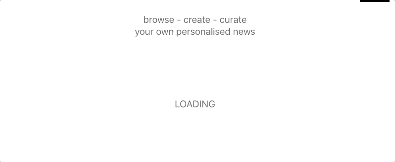
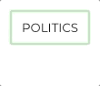
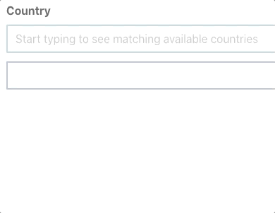

# GA PROJECT 2: NEWSFEED
### BRIEF

As a team of 2, create a front end for consuming a publicly available API using React.

### TIMEFRAME

This project was to be designed and completed within 2 days.

### OUTLINE

We decided to use the News API  to build a newsfeed app, where the user would be able to search for news from around the world and filter the results by category, country or source and then optionally add those search criteria to the home page so that a user would be able to have a custom newsfeed.
We felt that this was an opportunity to take a potentially dry subject matter and focus on the presentation by adding a bit of style and pop with animation.

### PROCESS

A large part of our first day was dominated by setting up the structure of the app. We put a few hours into planning the functionality and user stories and recorded it all in a document which really paid off at this point as it allowed us to focus on building the constituent components without having to rework them too much as we added other features.

This was the first time that we had used React on a project. I found it took me some time to get my head around the structure needed for React and to switch my mindset into its style of separating concerns.

The change in structural organisation along with working with a partner for the first time meant that we spent quite a lot of time on this project adapting our work flow and discussing everything in detail, with a lot of time spent pair programming.

After the first day we decided to focus our efforts on separate tasks as much as possible. I took responsibility for constructing the components that would display the stories returned from the API as well as the general styling. This left my partner free to work on the API requests and the search / filter  components.

#### DESIGNING CARDS AND STYLING

The stories were to be displayed using cards that showed the headline along with the image. This would then transform upon a mouse over to show the summary and details instead of the image.

I had started the design for these elements by looking for inspiration on the internet; I had found a great collection of example cards and taken various aspects of them to create my own style. The two main things that the card would consist of were a sliding animation from image to text and a fanning effect of rectangles behind the card as if they were a pile of papers being spread out.

I also decided upon a colour scheme largely inspired by the Recurse Centre website; this was a simple design which emphasised the text content whilst lending it a nice pop with the bright multi-coloured highlights. I think that this was a nice fit for what we were trying to achieve so I chose a few simple colours and set them as the standard for the whole app using SASS variables.
Using these colours for the fanned cards emphasised the mouse over effect, as the colours would be much more visible in that state, but the effect was not overwhelming and the overall perception of the site was still quite simple and focused on the content, just as I had hoped.

Taking this inspiration from the Recurse site further I then designed a simple logo for the app in pixel-art style. It was a representation of a newspaper and the inclusion of it in the header of the main page was really effective in adding a bit of character to the app without compromising its simplicity.

#### ANIMATION

This was the first time that I had delved into using animation for transitions and it turned out to be a really fun aspect of the whole process. We only had a need for a few simple animations: loading in results,  hiding the search component and hovering on the cards. In trying to implement the transition animations I was forced to refactor a lot of the HTML that I had already written to separate the different elements involved in the animation. So, unexpectedly, creating the animation caused me to have a much better understanding of how to structure my HTML and CSS classes. I was impressed by how the use of a few simple CSS transitions could combine into a very satisfying effect. This exercise also gave me a much more detailed understanding of CSS in general as I was forced to use various new properties and find the limitations and workarounds of the ones that I already knew.

#### PROBLEMS WITH CSS

The CSS file was one of the pain points in this project. We found that we were both in need of different things from the CSS when we were working on different components of the app and this led to a lot of separate but overlapping class definitions, which in turn led to drastically reduced readability as well as a lot of instances of merge conflicts.
I think that this was a great learning experience for understanding how to structure the CSS file and classes within it; Going back to the file at the end of the project to refactor it, I rewrote or reorganised almost all of it using SASS and managed to remove a significant amount of code by combining classes and making some more multi-purposed.
This was a more general lesson learned about working in a team; appropriately named and clear intentioned code has the potential to greatly reduce confusion and leave more time for constructive discussions rather than explaining code. In future projects I will be spending more time in the early stages laying out the styling structure and shying away from quick fixes by using ID’s or unique classes. I think that the change of mindset in using React was really helpful to understanding how to separate concerns.

### WORKING WITH AN EXTERNAL API

Along the way we had some problems working with the News API. Our first issue was that the data that was returned didn’t always fit into our designs for the cards. Because the data was sourced from all around the world and sometimes generated by algorithms, the format of it was often not uniform; we found that we had to go back to our designs and rework them with the data in mind as we had no control over what was being sent. 

The next issue was that we were hitting our request limits in a matter of hours; this was exacerbated by the nature of testing, as we were refreshing the pages a lot for every small tweak. The major issue though was that when multiple sources were added to the users feed, there would then be a single request for each one when the homepage was reloaded.

Upon deploying the app online we were shocked to discover that the News API was only available for free use with local requests. This was obviously a major issue and we talked it over how best to handle it. We ended up changing the API to GNews; this was actually a good exercise in adapting to new obstacles and we found that working with the new API was much smoother with our recent experience in mind. We had to make some concessions, such as not being able to search by source name anymore, but overall it was a smooth transition. 
 We took this opportunity to put a timestamp on the feed results and only reloaded them after a certain amount of time in order to fix the problem of overloading the API with requests.

#### CUSTOM FEED

We wanted to add some functionality to our app rather than just displaying the data from an external API and so we set out to implement a custom news feed that the user could populate from searches that they carried out. I added some subscribe buttons to the results pages that corresponded with the search parameters. Upon clicking the button, the query would be saved to local storage; visiting the homepage would then trigger a series of requests based on the items in local storage.

The functionality for this was simple, but the question of presentation took a lot more time to resolve. Unlike the normal search results, the feed consisted of separate groups of data for each saved query. Simply stacking all the results on top of each other with headers in-between meant that some content easily be buried at the bottom of a long page as I was displaying 20 results per section. I solved this by the use of horizontal scrolling containers which meant that each section would only take up one line of results. This took some time in tweaking the CSS to display the container properly and change the scroll controls, but it worked really well and instantly made the homepage more readable.

Upon adding an unsubscribe button to each section I found that removing the section from the page in a smooth way to be really tricky. I wanted to have a similar effect to the other animations that I had made and slide the section away rather than just removing it. This involved a similar process to before where I was forced to refactor and simplify the structure in order to create simple transitions.

#### CREATING A SEARCH-AHEAD FORM

Styling form components in general was something that I learned a lot about on this project and found it to be much more complicated than I had imagined. The result of styling the forms was important for consistency in the overall design.
We wanted to have a search ahead for the country and sources input fields, as they would only accept specific values and we felt that a dropdown list was not the best user experience due to the large number of values. 

I started out thinking that this would be a simple problem to solve but it took a lot of tweaking and reworking in the end. The basic premise is that the list of accepted values is kept in an array and when the user types into the field the value is matched against the array using regular expressions. This returns a list of matching values and then a div element is constructed with all these items represented as child elements which have event listeners attached in order to autocomplete the field upon clicking.

The form was restructured to allow the suggestions container to use absolute conditioning and it is then layered on top of the form using a z index.
There were all sorts of quirks to iron out in this implementation with the use of regular expressions, handling empty values, checking for matches upon searching in the case where the user typed out the whole name and styling the element generally. Upon completion of the project I learned that similar components can be imported from 3rd parties to to achieve the same effect; so while it was a very useful learning exercise I doubt I would take this route if I built a similar project again.

### FUTURE IMPROVEMENTS

The experience of producing something in such a short timeframe was stressful yet fun and helped me to understand how to focus my efforts and prioritise tasks while working as a team. Because of the short timeframe we reached the end with a lot of potential improvements in mind. 
The main one is to greatly increase the options which the user has to filter the results. Some key ones that we hoped to implement were filters by date, language and querying titles / descriptions specifically.
I also would have liked to allow the feed to be based off more customised queries using the combination of search criteria rather than the single query method we have now.
The app is also designed solely for desktop at the moment, so the addition of responsive design would be a logical next step in its development.

